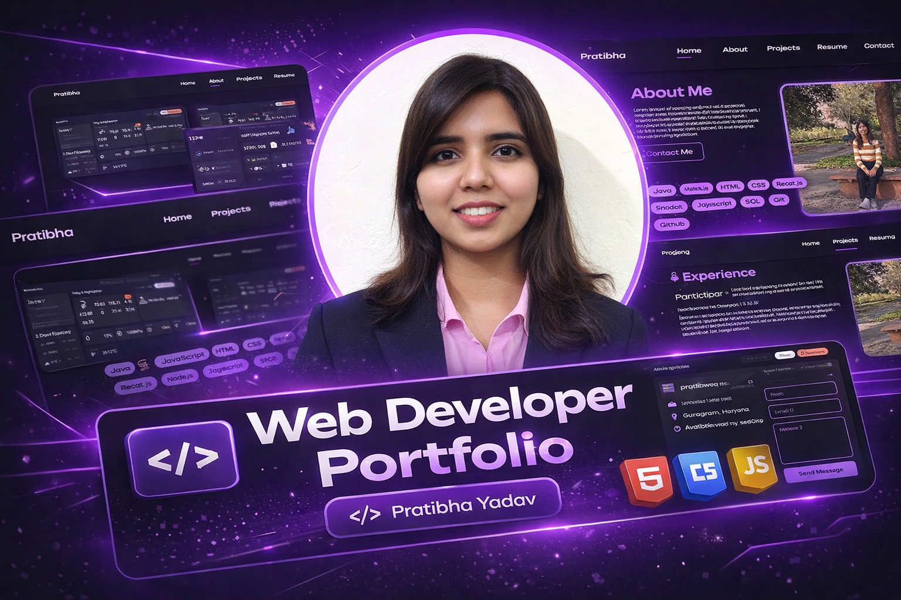

# 💻 Personal Portfolio Website



A **responsive personal portfolio website** built to showcase my projects, skills, experience, and contact information. This portfolio highlights my work in **web development, machine learning projects, and data analysis**, along with my resume and social links.

---

## 🚀 Live Demo
🔗 *(https://pratibhayadav-portfolio.netlify.app/)*

---

## ✨ Features

- Responsive design for desktop, tablet, and mobile
- Interactive project showcase
- Smooth scrolling navigation
- Animated typing effect for roles
- Scroll reveal animations
- Contact form integration with EmailJS
- Social media links (LinkedIn, GitHub, Instagram, X)
- Resume download option

---

## 🧩 Tech Stack

**Frontend**
- HTML5
- CSS3
- JavaScript

**Libraries & Tools**
- ScrollReveal.js
- Typed.js
- EmailJS
- Font Awesome
- Google Fonts

---

## 📌 Sections in the Website

### 🏠 Home
- Introduction
- Profile image
- Social media links
- Resume download button

### 👩‍💻 About
- Short bio
- Technical skills

### 📂 Projects

Includes projects such as:

- Personal Portfolio  
- Weather Web App  
- Music Player  
- Face Detection using OpenCV  
- Amazon Web Scraper  
- Exploratory Data Analysis (Iris Dataset)

### 📄 Resume
- Education
- Experience (Amazon ML Summer School)

### 📬 Contact
- Email
- Phone
- Location
- Contact form using EmailJS

---

## ⚙️ Installation & Setup

Clone the repository:

```bash
git clone https://github.com/yadavpratibha/Personal-Portfolio.git